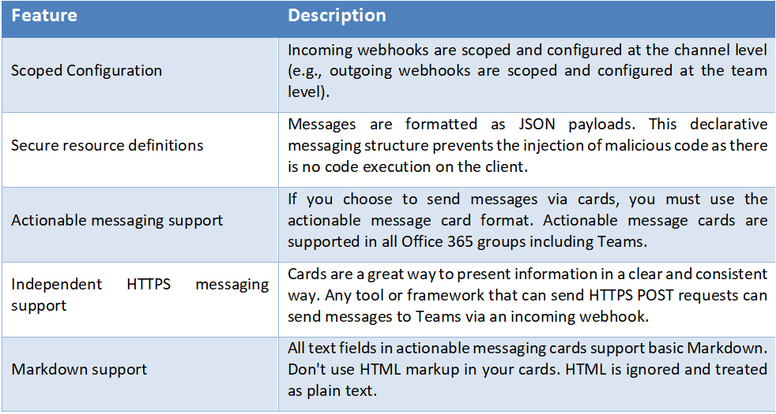
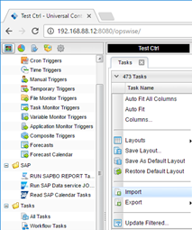
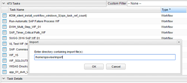
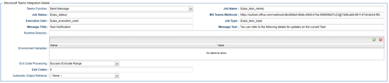

# ut-microsoft-teams-integration
Universal Automation Center Support for Microsoft Teams Integration 

# Abstract:

The here described Universal Tasks allow to send messages to an
existing channel of Microsoft Teams. As a result, you can integrate
this solution in UAC to notify users for UAC result on Microsoft
Teams.

# 1. Disclaimer

No support and no warranty are provided by Stonebranch GmbH for this
document and the related Universal Task. The use of this document and
the related Universal Task is on your own risk.

Before using this task in a production system, please perform extensive
testing.

Stonebranch GmbH assumes no liability for damage caused by the
performance of the Universal Tasks

# 2. Scope 

This document provides a documentation how to install and use the
Universal Tasks for Microsoft Teams Notifications Forwarding. If more
Task will be created in the future this document will be updated
accordingly.

# 3. Introduction
# 3.1 Incoming Webhooks in MS Teams

Incoming webhooks are special type of Connectors in MS Teams that
provide a simple way for an external app to share content in team
channels and are often used as tracking and notification tools. MS Teams
provides a unique URL to which you send a JSON payload with the message
that you want to POST, typically in a card format. Cards are
user-interface (UI) containers that contain content and actions related
to a single topic and are a way to present message data in a consistent
way. Teams uses cards within three capabilities:

-   Bots

-   Messaging extensions

-   Connectors

# 3.2 Adding an incoming webhook to a MS Teams channel

**Note:** If your MS Team's Settings => Member permissions => Allow members to create, update, and remove connectors is selected, any team member can add, modify, or delete a connector.[1]

    1.	Navigate to the channel where you want to add the webhook and select (•••) More Options from the top navigation bar.
    2.	Choose Connectors from the drop-down menu and search for Incoming Webhook.
    3.	Select the Configure button, provide a name, and, optionally, upload an image avatar for your webhook.
    4.	The dialog window will present a unique URL that will map to the channel. Make sure that you copy and save the URL—you will need to provide it to the outside service.
    5.	Select the Done button. The webhook will be available in the team channel.

# 3.3	Incoming Webhooks key features

Image 1:

# 3.4	Python Integration

pymsteams [2] is a Python Wrapper Library to send requests to Microsoft Teams Webhooks. Microsoft refers to these messages as Connector 
Cards. A message can be sent with only the main Connector Card, or additional sections can be included into the message. This library 
uses Webhook Connectors for Microsoft Teams.

# 3.5	Implementation Details

Some details about the universal tasks for MS Teams:

    •	Supports logging functionality, by selecting the log level by yourself (INFO, DEBUG, etc)
    •	Uses pymsteams python library
    •	Accepts as input parameters the log level, an incoming webhook a title and a text of the message 
    •	Set up the connection from UAC to MS Teams channel using webhooks
    •	Set up the message is about to send and forwards it to the channel
    •	No authentication is supported 
    •	The Universal Task supports both Universal Agent for Linux/Unix and Windows  and has been tested in both systems
   
# 4	Installation
# 4.1	Software Requirements for Linux Agent
**Universal Task name:** ut-microsoft-teams-messaging
**Requirements: **

    •	Python 3.6
    •	For Python the following modules are required: 
        •	sys, for system-specific parameters and functions
        •	pymsteams, to interact with a Microsoft Teams channel
        •	logging, for python loglevel support
        **Note:** Only the module pymsteams needs to be added via python installer 
            •pip install pymsteams
    •	Universal Controller V6.4.7.0 or higher
    •	Universal Agent V6.5.0.0 or higher installed on a Linux/Windows Server

# 4.2	Installation Steps

The following describes the installation steps:

**1.	Check the current Python Version**

    python -V  (Note: Capital “V”)

If your Version is Python 3.6 or later all is fine. If a no python or a lower Version has been installed upgrade your python Version or 
install the Universal Agent with the Python binding option (--python yes). This option will install python 3.6. along with your 
universal agent.

e.g.

    sudo sh ./unvinst --network_provider oms --oms_servers 7878@192.168.88.12 --oms_port 7878 --oms_autostart no --ac_netname OPSAUTOCONF --opscli yes --python yes

**2.	Add the required python modules**

In a command shell run as sudo or root:
    
    •	For Python the following modules are required: 
        •	pip install pymsteams
        or in case of universal Agent with python binding: 
        /opt/universal/python3.6/bin/python3 -m pip install pymsteams
        
        Only run these if not available already:
        •	pip install sys
        •	pip install logging

**Note:**

It is assumed that the modules logging, sys, datetime, os are already available. If not install them via pip. Only the module pymsteams is not part of your installation.

**3.	Import MS Teams Universal Task including the Universal Template to your Controller**

Go to “All Tasks” and load via the Import functionality the Universal Tasks configuration into the Controller. 

Image 2:

Image 3:

# 5	Universal Task Configuration

**1.	Fill Out MS Teams Universal Task:**

Image 4:

Universal Tasks for MS Teams Notifications Forwarding
=====================================================

The following chapter describes the provided MS Teams Notifications
Forwarding Universal Tasks.

  UT Name                   Description
  ------------------------- ----------------------------------------------------------------
  ut-ms-teams-integration   Send notification to Microsoft teams incoming webhook channel.

Send message
------------

With Send Message function we can send a notification message to the
Microsoft Teams channel with the current task instance details.

**Field Description:**

+------------------+--------------------------------------------------+
| Field            | Description                                      |
+==================+==================================================+
| Agent            | The Agent that runs the Python script assigned   |
|                  | to the Universal Task                            |
+------------------+--------------------------------------------------+
| Teams Function   | Send Message                                     |
+------------------+--------------------------------------------------+
| Job Name         | Name of the job, by default it takes the current |
|                  | job name                                         |
|                  |                                                  |
|                  | \${ops_task_name}                                |
+------------------+--------------------------------------------------+
| Job Status       | Status of the job, by default it takes the       |
|                  | current job name                                 |
|                  |                                                  |
|                  | \${ops_status}                                   |
+------------------+--------------------------------------------------+
| MS Teams Webhook | The incoming web hook of Microsoft Teams channel |
+------------------+--------------------------------------------------+
| Execution User   | Details of the execution user, by default takes  |
|                  | the current user name                            |
|                  |                                                  |
|                  | \${ops_execution_user}                           |
+------------------+--------------------------------------------------+
| Job type         | Task type of task instance, by default takes the |
|                  | current task instance type                       |
|                  |                                                  |
|                  | \${ops_task_type}                                |
+------------------+--------------------------------------------------+
| Message Title    | The title of the message sent to Microsoft Teams |
|                  | channel                                          |
+------------------+--------------------------------------------------+
| Message Text     | The text of the message sent to Microsoft Teams  |
|                  | channel                                          |
+------------------+--------------------------------------------------+

{width="6.298611111111111in"
height="1.6659722222222222in"}

Approval Notification
---------------------

Manual tasks are typically used when there is a need for manual
intervention of user in a workflow process. Traditionally the Manual
Task is completed successfully in the Universal controller by clicking
"Set Completed" command.

With this universal task for Microsoft teams we can provide you with a
notification in the Microsoft team incoming webhook channel, when the
workflow reaches the manual task with status "Action Required".

Upon receiving the notification on the teams channel the Users can click
on on the "Approve" Button in the interactive message for the workflow
to proceed further. This interactive message is sent from the Universal
controller.

When the "Approve" or "Reject" button is clicked in the interactive
message an API call is made to a function where it can handle the event
from the Microsoft Teams. For example we use python function in AWS
lambda + API gateway or Azure functions or any custom URL where the
Teams messaging platform can make an API POST call to handle the user
action in the message as a payload and based on the posted payload data
from the Teams , Universal controller API call will be made to set the
manual task either to set complete status or No action in the function.
Please refer to the handler.py file in the serverless function folder
for a sample serverless function implementation using AWS lambda.

The parameters that would be need for this API function module would be
as below :

-   Teams event payload data

-   Universal controller URL

-   Universal controller User name and Password (for making the API
    call)

**Field Description:**

+------------------+--------------------------------------------------+
| Field            | Description                                      |
+==================+==================================================+
| Agent            | The Agent that runs the Python script assigned   |
|                  | to the Universal Task                            |
+------------------+--------------------------------------------------+
| Teams Function   | Approval Notification                            |
+------------------+--------------------------------------------------+
| Job Name         | Name of the job, by default it takes the current |
|                  | job name                                         |
|                  |                                                  |
|                  | \${ops_task_name}                                |
+------------------+--------------------------------------------------+
| Job Status       | Status of the job, by default it takes the       |
|                  | current job name                                 |
|                  |                                                  |
|                  | \${ops_status}                                   |
+------------------+--------------------------------------------------+
| MS Teams Webhook | The incoming web hook of Microsoft Teams channel |
+------------------+--------------------------------------------------+
| Execution User   | Details of the execution user, by default takes  |
|                  | the current user name                            |
|                  |                                                  |
|                  | \${ops_execution_user}                           |
+------------------+--------------------------------------------------+
| Job type         | Task type of task instance, by default takes the |
|                  | current task instance type                       |
|                  |                                                  |
|                  | \${ops_task_type}                                |
+------------------+--------------------------------------------------+
| Message Title    | The title of the message sent to Microsoft Teams |
|                  | channel                                          |
+------------------+--------------------------------------------------+
| Message Text     | The text of the message sent to Microsoft Teams  |
|                  | channel                                          |
+------------------+--------------------------------------------------+

Changes to be made on the serverless function(handler.py) :

1.  Change the API gateway endpoint in Universal Task

2.  Change the incoming webhook in the serverless function

3.  Change the Universal Controller endpoint in the serverless function

4.  Change the Universal Controller user credentials in the serverless
    function

{width="6.298611111111111in"
height="4.2027777777777775in"}

Test Cases
==========

The following basic test cases has been performed:

+----------------------------+----------------------------+---------+
| Case\#                     | Assumed behavior           | Result  |
+============================+============================+=========+
| Set as Incoming Webhook an | 1\. The application should | Correct |
| invalid uri                | stop and exit with message |         |
|                            | UAC failed to forward a    |         |
|                            | message in this MS Teams   |         |
|                            | channel.                   |         |
|                            |                            |         |
|                            | 2\. No message should be   |         |
|                            | sent.                      |         |
+----------------------------+----------------------------+---------+
| Set as Incoming Webhook a  | 1\. A message should be    | Correct |
| valid uri                  | sent.                      |         |
+----------------------------+----------------------------+---------+

Document References
===================

This document references the following documents:

+------------------------------+--------------------------------------+
| Ref\#                        | Description                          |
+==============================+======================================+
| 1.  Microsoft Teams Webhooks | <h                                   |
|                              | ttps://docs.microsoft.com/en-us/micr |
|                              | osoftteams/platform/webhooks-and-con |
|                              | nectors/how-to/add-incoming-webhook> |
+------------------------------+--------------------------------------+
| 2.  requests                 | <https://pyp                         |
|                              | i.org/project/requests/#description> |
+------------------------------+--------------------------------------+
